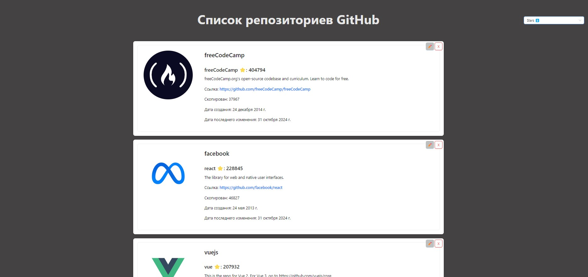

# Список репозиториев GITHUB

[](#)
[](#)
[](#)

[](#)
[](#)

[](#)
[](#)

[](#)
[](#)

## Описание
  
Приложение реализует отображение списка репозиториев GITHUB, запрашиваемых с [API GitHub](https://docs.github.com/en/rest/about-the-rest-api/about-the-rest-api?apiVersion=2022-11-28 "Перейти на сайт документации API GitHub"). Поддерживает постраничную загрузку данных с сервера и бесконечный скролл реализованный c помощью *браузерного API* [Intersection Observer](https://developer.mozilla.org/en-US/docs/Web/API/IntersectionObserverEntry "Ссылка на MDN Intersection Observer API"). Так же реализовано локальное удаление, редактирование элементов списка и сортировка по количеству звезд, форков и дате последнего обновления.
  
Для создания пользовательского интерфейса была выбрана библиотека [Ant Design (ANTD)](https://ant.design/docs/react/introduce "Перейти на сайт на Ant Design"). ANTD предоставляет широкий выбор готовых компонентов, разработанных с учетом современных тенденций в дизайне, имеет хорошую поддержку TypeScript, предоставляет возможность легко настраивать компоненты под нужды проекта. Это позволяет быстро разрабатывать интерфейсы и сокращает время на реализацию.

## Live просмотр



👉 [Перейти на страницу демо](https://repositoriesgithub-8c3c2.web.app)


Либо запустить локально:
```
git clone https://github.com/DalilaM25/RepositoriesGITHUB.git
cd RepositoriesGITHUB-main
npm i
npm run build
npm run serve
```
Приложение запустится. В консоли появится ссылка, чтобы его открыть.

## Что можно доработать...
Приложение находится в полностью рабочем состоянии, весь функционал осуществлен и работает корректно. Если рассматривать продолжение развития проекта, вот что можно было бы улучшить:

- [ ] Добавить виртуализацию с использованием библиотеки  `react-window` или `react-virtualized`. Это позволит снизить нагрузку на браузер при подгрузке слишком большого списка.
- [ ] Улучшить дизайн. Сделать его более адаптивным и доступным. (На данный момент реализован минимальный необходимый для работы приложения)
- [ ] Добавить возможность поиска по имени пользователя или названию репозитория.
- [ ] Добавить сохранение списка понравившихся репозиториев между перезагрузками страницы.
